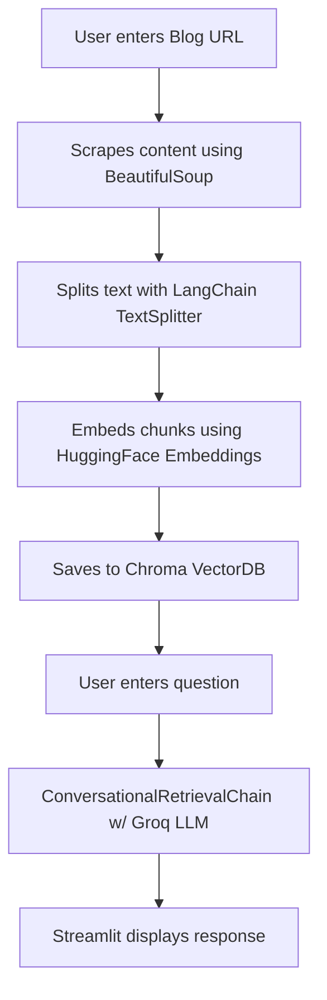

# 🤖 BLOGbot — Your AI-Powered Blog Analysis Companion
> Turn blog posts into interactive, intelligent conversations powered by state-of-the-art open-source LLMs via **Groq**.

---

## ✨ What is BLOGbot?

BLOGbot lets users input any blog URL, fetches the content, and builds a conversational interface where users can ask context-aware questions about the blog. Think of it as ChatGPT but tailored just for any blog article.

---

## 🔧 Tech Stack

* **LLM Backend:** [Groq](https://groq.com) + Open-source models (via `langchain_groq`)
* **Embedding Model:** HuggingFace (`all-MiniLM-L6-v2`, etc.)
* **Vector Store:** ChromaDB
* **Text Processing:** LangChain's `RecursiveCharacterTextSplitter`
* **Web Scraping:** `requests`, `BeautifulSoup`
* **Frontend:** Streamlit
* **Memory:** LangChain's `ConversationBufferMemory`
* **DotEnv:** `.env` file to securely manage keys

---

## 📸 App Preview

) <!-- Use your provided image: Screenshot 2025-05-24 144228.png -->

---

## 🚀 Features

* 🔗 **Enter Any Blog URL** — Just paste a Medium or blog link, and it fetches the content.
* 🧠 **Ask Anything** — Powered by Groq-hosted open-source LLMs for real-time, intelligent Q\&A.
* 🧩 **Smart Embeddings** — Blog content is chunked and embedded with HuggingFace Embeddings.
* 🧵 **Conversation Memory** — Maintains context between your questions.
* 🖥️ **Streamlit UI** — Lightweight, beautiful, and interactive web interface.

---

## 🛠️ How It Works

## 🧠 Models Used

| Component       | Model                              |
| --------------- | ---------------------------------- |
| Embeddings      | `all-MiniLM-L6-v2` (HuggingFace)   |
| Language Model  | Open-source LLM via Groq           |
| Vector Database | Chroma                             |
| Memory Buffer   | LangChain ConversationBufferMemory |

---

## 🛡️ License
 . Feel free to use, modify, and share!

---

## 🤝 Contributions

Want to add multi-blog support? Improve summarization? Jump in! PRs and issues are welcome.

---

## 🧠 Powered By

* [LangChain](https://www.langchain.com/)
* [Groq](https://groq.com/)
* [HuggingFace Transformers](https://huggingface.co/)
* [Streamlit](https://streamlit.io/)
* [BeautifulSoup](https://www.crummy.com/software/BeautifulSoup/)

